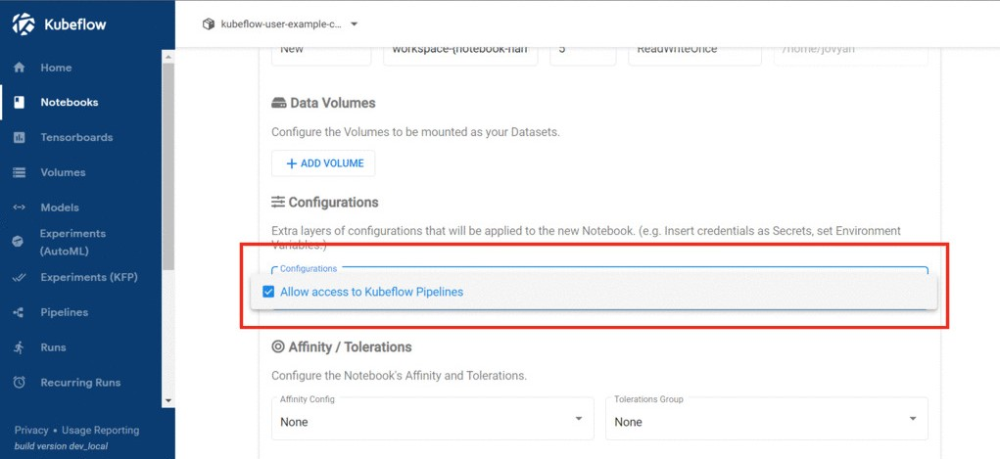

# Access Kubeflow Pipelines from Jupyter notebook

This guide demonstrates how to connect to Kubeflow Pipelines using the Kubeflow Pipelines SDK client, and how to configure the SDK client using environment variables.

- In order to access Kubeflow Pipelines from Jupyter notebook, an additional per namespace (profile) manifest is required.

- Create a file ```kfp_access.yaml ``` and copy the below contents to the file (replace the namespace field with your namespace).

```
apiVersion: kubeflow.org/v1alpha1
kind: PodDefault
metadata:
  name: access-ml-pipeline
  namespace: "<YOUR_USER_PROFILE_NAMESPACE>"
spec:
  desc: Allow access to Kubeflow Pipelines
  selector:
    matchLabels:
      access-ml-pipeline: "true"
  volumes:
    - name: volume-kf-pipeline-token
      projected:
        sources:
          - serviceAccountToken:
              path: token
              expirationSeconds: 7200
              audience: pipelines.kubeflow.org      
  volumeMounts:
    - mountPath: /var/run/secrets/kubeflow/pipelines
      name: volume-kf-pipeline-token
      readOnly: true
  env:
    - name: KF_PIPELINES_SA_TOKEN_PATH
      value: /var/run/secrets/kubeflow/pipelines/token
```

- Run the below command to apply the manifest.

```
kubectl apply -f kfp_access.yaml
```

-  After the manifest is applied, newly created Jupyter notebook contains an additional option in the configurations section.

- Make sure to select the configuration option while creating the notebook server.


