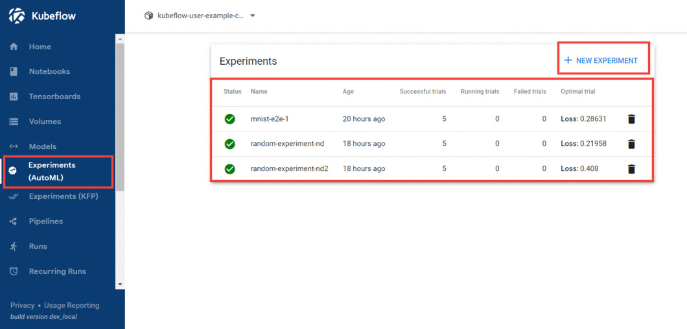

# Katib(AutoML)

**Katib** is a Kubernetes-native project for automated machine learning (AutoML). Katib supports hyperparameter tuning, early stopping and neural architecture search (NAS).

Katib is the project which is agnostic to machine learning (ML) frameworks. It can tune hyperparameters of applications written in any language of the users' choice and natively supports many ML frameworks, such as TensorFlow, MXNet, PyTorch, XGBoost, and others.

Katib supports a lot of various AutoML algorithms, such as Bayesian optimization, Tree of Parzen Estimators, Random Search, Covariance Matrix Adaptation Evolution Strategy, Hyperband, Efficient Neural Architecture Search, Differentiable Architecture Search and many more. 

Katib runs several training jobs (known as trials) within each hyperparameter tuning job (experiment). Each trial tests a different set of hyperparameter configurations. At the end of the experiment, Katib outputs the optimized values for the hyperparameters.

You can improve your hyperparameter tunning experiments by using early stopping techniques. Follow the [early stopping guide](https://www.kubeflow.org/docs/components/katib/early-stopping/) for the details.

 
 

# Table of Contents

[Katib through UI](#katibUI)

[Katib through SDK](#katibSDK)

[Reference Links](#reference)

 
 

### **Katib UI**
 

- To access katib navigate to "Experiments(AutoML)" tab from the kubeflow central dashboard.

- You can view the list of already created experiments.

- Click on the "New Experiment" button on the top right, you will be navigated to a page where you can create an experiment.

- You can create an experiment by editing the input fields or by editing the yaml file, in this example we will look at how to create an experiment by applying the yaml file.

- Click on edit and submit yaml button, it will open an editor where you can enter the yaml configuration for the experiment.

- Delete already existing yaml and copy the contents from [experiment.yaml](https://github.com/pranavaninadam/kfp-demo/blob/main/notebooks/experiment.yaml) file and click on create to submit the experiment.

- Once the experiment is submitted, you can view the running experiment by clicking on the experiment.

- Depending on the algorithm the experiment takes some time to complete.

- After the experiment ran succesfully click on the experiment to view the trails it ran and the optimal values.

 
 

### **Katib SDK**
 

- In this example we use kubeflow-katib SDK to achieve the same experiment that we did using the UI.

- Before proceeding any further make sure you configured your notebook. Follow [this](https://github.com/pranavaninadam/kfp-demo/blob/main/runbooks/configure-notebook.md) guide to configure your notebook.

- Follow this [notebook](https://github.com/pranavaninadam/kfp-demo/blob/main/notebooks/katib-sample.ipynb) for step by step explaination.

 
 

### **Reference Links**
 

- [Katib](https://www.kubeflow.org/docs/components/katib/overview/)

- [Katib SDK](https://github.com/kubeflow/katib/tree/master/sdk/python/v1beta1/kubeflow/katib)

- [Katib Example](https://github.com/kubeflow/katib/blob/master/examples/v1beta1/kubeflow-pipelines/kubeflow-e2e-mnist.ipynb)