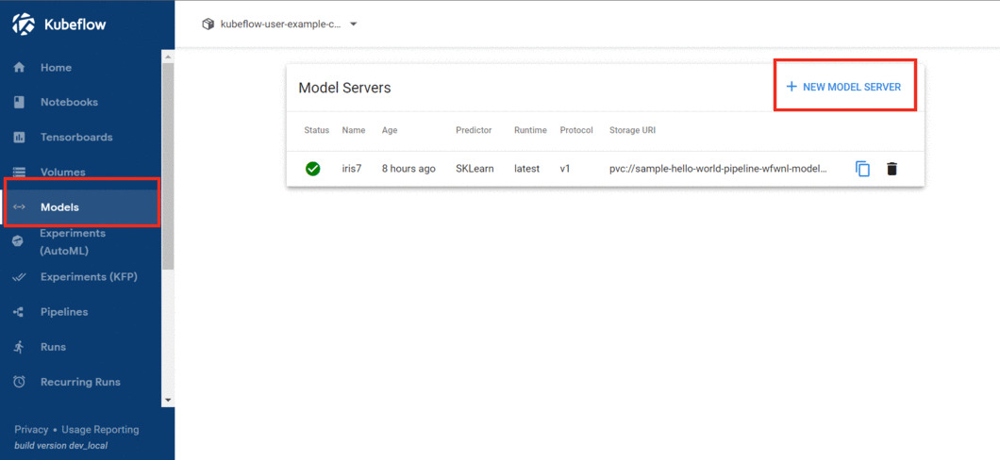
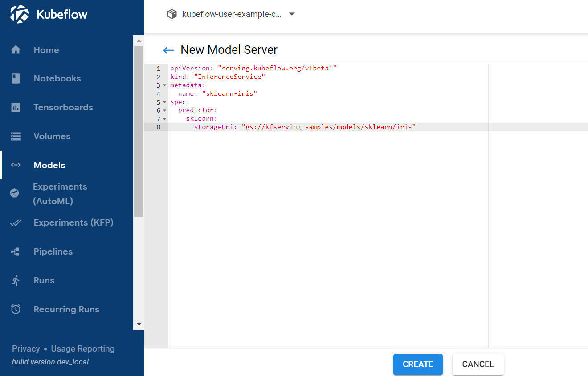
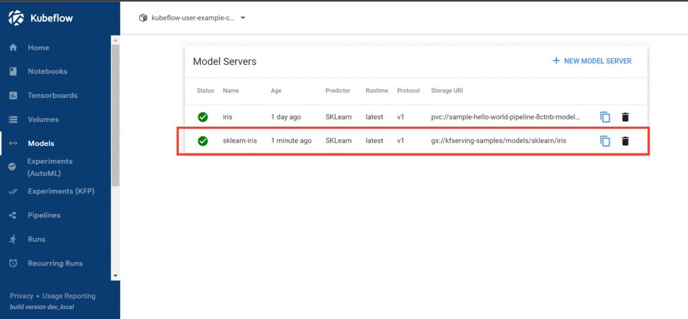
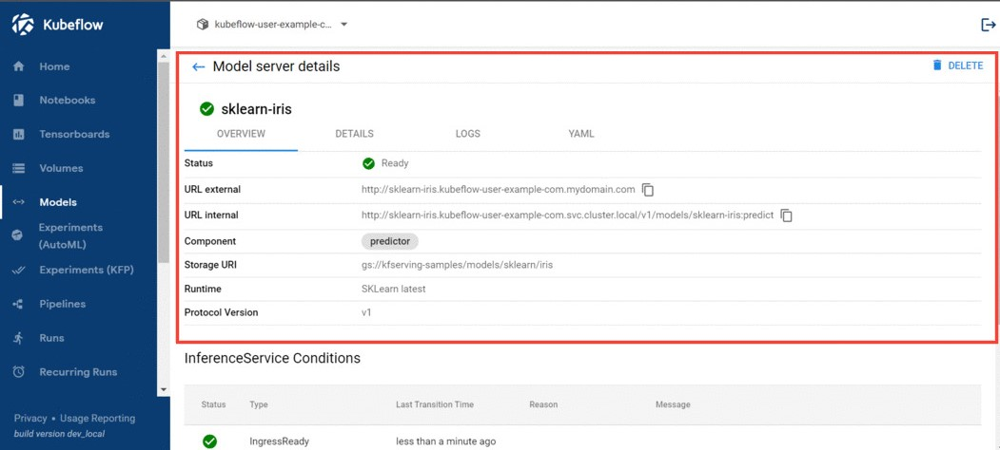

# Table of Contents
 - [ Introduction to KFServing ](#intro)
 - [ Examples ](#examples)
    - [ KFServing through UI ](#kfserveUI)
    - [ KFServing through SDK ](#kfserveSDK)
 - [ Reference Links ](#reference)

<br /> <hr> <br />

<a name="intro"></a>

## Introduction to KFServing

<br/>


KFServing enables serverless inferencing on Kubernetes and provides performant, high abstraction interfaces for common machine learning (ML) frameworks like **TensorFlow**, **XGBoost**, **scikit-learn**, **PyTorch**, and **ONNX** to solve production model serving use cases.


You can use KFServing to do the following:


- Provide a Kubernetes Custom Resource Definition for serving ML models on arbitrary frameworks.

- Encapsulate the complexity of autoscaling, networking, health checking, and server configuration to bring cutting edge serving features like GPU autoscaling, scale to zero, and canary rollouts to your ML deployments.

- Enable a simple, pluggable, and complete story for your production ML inference server by providing prediction, pre-processing, post-processing and explainability out of the box.

- The Models web app is an abstraction that provides users a graphical UI to manage their Model servers, by performing CRUD operations on top of InferenceService CustomResources.

<br /> <hr> <br />

<a name="examples"></a>

## Examples
<br>
<hr>

<a name="kfserveUI"></a>

## KFServing through UI

<br/>

**Prerequisites**

Before using kfserve you must have a ML model ready and it should be uploaded to S3 or GCP bucket

**Example**

- To access the models UI, click on the models option from the kubeflow dashboard.

- Click on New Model Server button to create a InferenceService.



- You will be navigated to a text editor where you can write the yaml configuration for the model server.



- Copy paste the below code in the editor and click on create button to create an inference.

```
apiVersion: "serving.kubeflow.org/v1beta1"
kind: "InferenceService"
metadata:
  name: "sklearn-iris"
spec:
  predictor:
    sklearn:
      storageUri: "gs://kfserving-samples/models/sklearn/iris"
```

- Once the Inference is created you can find the inference in the models page.



- Click on the Inference to find more details.




- To test the inference prepare a sample data.

```
{
  "instances": [
    [6.8,  2.8,  4.8,  1.4],
    [6.0,  3.4,  4.5,  1.6]
  ]
}
```

- Once you've created your json test input file (named something like "iris-input.json") we can use the curl command to test the inference.


```
curl -L --cookie 'authservice_session=<your-cookie>' http://sklearn-iris.kubeflow-user-example-com.svc.cluster.local/v1/models/sklearn-iris:predict -d @./iris-input.json
```

- Here we are using the internal url so we pass the cookie for authentication.

<br/> <hr>

<a name="kfserveSDK"></a>

## KFServing through SDK

<br/>

To Use KFServing to serve your custom model there are a few things to consider.

 - The versions you are using to develop your model should be supported by kfserve. 
 - This [link](https://github.com/kserve/kserve/tree/master/docs/samples#kserve-features-and-examples) contains the supported versions of various modules.

 - Since the KServe SKLearnServer image is built from a specific version of scikit-learn pip package, sometimes it might not be compatible with the pickled model you saved from your training environment, however you can build your own SKLearnServer image following [these instructions](https://github.com/kserve/kserve/tree/master/python/sklearnserver#building-your-own-scikit-learn-server-docker-image).

 - To use your SKLearnServer image, we must add the image to the kserve configmap.

```
kubectl edit configmap inference-config -n kubeflow
```

```
        "sklearn": {
            "image": "<your-dockerhub-id>/kfserving/sklearnserver",
        },
```
 - After modifying the inference-config with your image, you can go ahead and create an inference for your custom model.

 - Follow [this](https://github.com/pranavaninadam/kfp-demo/blob/main/end-to-end-pipeline.ipynb) link to create a custom model and serve it through kfserving.

 <br /> <hr> <br />

<a name="intro"></a>

## Reference Links

<br/>

- [KFServe](https://www.kubeflow.org/docs/components/kfserving/kfserving/)

- [Models UI](https://www.kubeflow.org/docs/components/kfserving/webapp/)

- [Run SKLearn InferenceService with your own image](https://github.com/kserve/kserve/tree/master/docs/samples/v1beta1/sklearn/v1#run-sklearn-inferenceservice-with-your-own-image)

- [Run your first InferenceService](https://kserve.github.io/website/get_started/first_isvc/)