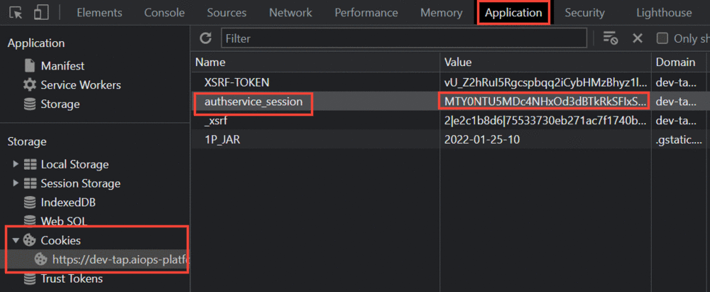
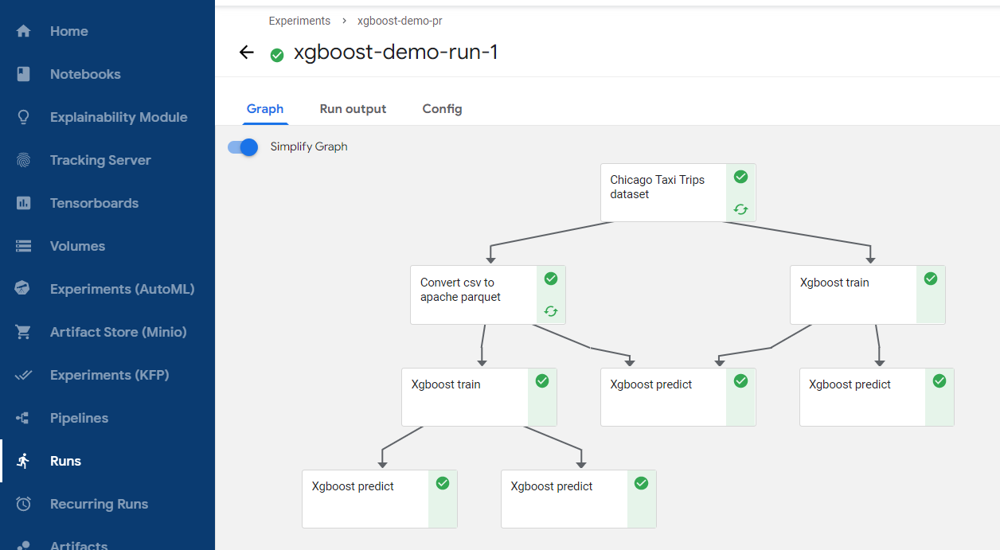
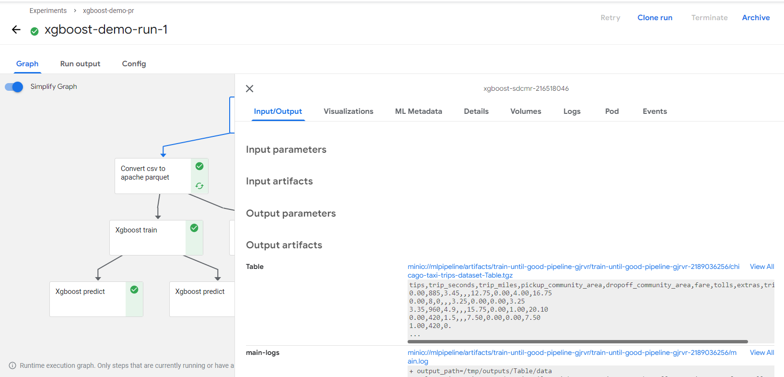

Use [this](https://www.kubeflow.org/docs/components/pipelines/overview/quickstart/) guide if you want to get an introduction to the Kubeflow Piplines user interface (UI) and get a simple pipeline running quickly.

<br />

# Steps to Create a  pipeline

1. Open the notebook server and start by installing kfp module

```
!pip install kfp --upgrade
```

2. A pipeline component is a self-contained set of user code, packaged as a Docker image, that performs one step in the pipeline. For example, a component can be responsible for **data preprocessing**, **data transformation**, **model training**, and so on.

3. Kubeflow provides various ways to create a component, You can build components by [defining a component specification](https://www.kubeflow.org/docs/components/pipelines/sdk/component-development/) for a containerized application, or you can use the [Kubeflow Pipelines SDK](https://kubeflow-pipelines.readthedocs.io/en/stable/index.html) to generate a component specification for a Python function. You can also reuse prebuilt components in your pipeline.

4. In this example we will build a pipeline using pre-built components.

5. Import the kfp and kfp.components packages.

```
import kfp
import kfp.components as comp
```

6. in-cluster communication from notebook to Kubeflow Pipeline is not supported in this phase. In order to use kfp as previous, user needs to pass a cookie to KFP for communication as a workaround.

    - Open developer tools, select Application, under cookies copy the cookie value of authservice_session.

    <br />

    

    - Use the below code to connect to kfp client

    <br />

    ```
    authservice_session='authservice_session=<your-cookie>'
    ```
    
    ```
    client = kfp.Client(host="dev-tap.aiops-platform.io/pipeline", cookies=authservice_session)
    ```

7. [This](https://github.com/pranavaninadam/kfp-demo/blob/main/ml-pipeline-demo.ipynb) notebook contains the code to create a pipeline.

8. Once the run link has been generated, click the link and it will redirect to the UI, the pipeline graph should look something like this.



9. Click on a component to view more details.

