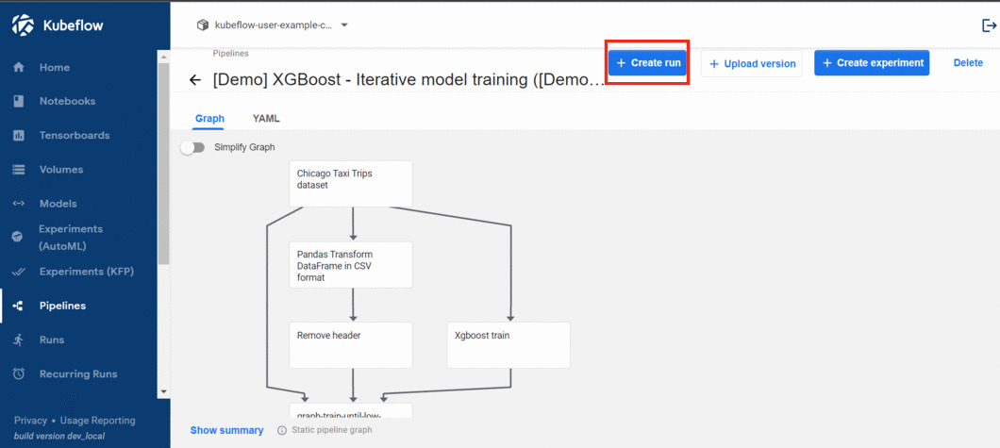

# Kubeflow Pipelines and Kfserving

### **Kubeflow Pipelines**
Kubeflow Pipelines is a platform for building and deploying portable, scalable machine learning (ML) workflows based on Docker containers.

The Kubeflow Pipelines platform consists of:

- A user interface (UI) for managing and tracking experiments, jobs, and runs.
- An engine for scheduling multi-step ML workflows.
- An SDK for defining and manipulating pipelines and components.
- Notebooks for interacting with the system using the SDK.

### **KFServing**
KFServing enables serverless inferencing on Kubernetes and provides performant, high abstraction interfaces for common machine learning (ML) frameworks like TensorFlow, XGBoost, scikit-learn, PyTorch, and ONNX to solve production model serving use cases.

 

# Table of contents
- [ Intro to Kubeflow pipelines UI ](#intro)
- [ Hello World Pipeline from UI ](#pipelineUI)
- [ Hello World Pipeline with SDK ](#pipelineSDK)
- [ Pipeline with prebuilt components ](#pipelineSDK1)
- [ Custom E2E pipeline including KFServing ](#pipelineSDK2)
- [ Troubleshoot Guide ](#troubleshoot)
- [ Reference Links ](#reference)
  
  

## Intro to Kubeflow pipelines UI

 

Kubeflow Pipelines offer a few samples that you can use to try out Kubeflow Pipelines quickly. The steps below show you how to run a sample pipeline.

- Navigate to pipelines section from the kubeflow dashboard and click on the xgboost iterative model training example.

- It will redirect to the page as shown below.

- Click on create run button on the top right, you will be redirected to the runs page. In kubeflow a pipeline run is attached to an experiment, to start the run you must choose an experiment.

- To run this example we choose the "Default" experiment which is alredy created, click on use this experiment.

- Click on start button to start the pipeline.

- You will be redirected to the runs page where you can view current run under default experiment.

- Click on the run to view the pipeline graph.

- Click on a component to view more details such as input parameters, output parameters, logs etc.

  
  

## Hello World Pipeline with SDK

 

In this section we will learn how to build a basic custom ML pipeline.

To start building our pipeline we must configure the notebook, follow this [link](https://github.com/pranavaninadam/kfp-demo/blob/main/runbooks/configure-notebook.md) to get started and create a notebook server.

Follow [this](https://github.com/pranavaninadam/kfp-demo/blob/main/notebooks/hello-world-pipeline.ipynb) notebook for a step by step explaination.

  
  

## Pipeline with prebuilt components

 

**Prerequisites**
 

To start building our pipeline we must configure the notebook, follow this [link](https://github.com/pranavaninadam/kfp-demo/blob/main/runbooks/configure-notebook.md) to get started and create a notebook server.
 

In this section we will learn how to build a ML pipeline using prebuilt components.

- A pipeline component is a self-contained set of user code, packaged as a Docker image, that performs one step in the pipeline. For example, a component can be responsible for **data preprocessing**, **data transformation**, **model training**, and so on.

- Kubeflow provides various ways to create a component, You can build components by [defining a component specification](https://www.kubeflow.org/docs/components/pipelines/sdk/component-development/) for a containerized application, or you can use the [Kubeflow Pipelines SDK](https://kubeflow-pipelines.readthedocs.io/en/stable/index.html) to generate a component specification for a Python function. You can also reuse prebuilt components in your pipeline.

- In this example we will build a pipeline using pre-built components.

- Follow [this](https://github.com/pranavaninadam/kfp-demo/blob/main/ml-pipeline-with-prebuilt-components.ipynb) notebook for a step by step explaination.

  
  

## Custom E2E pipeline including KFServing

 

**Prerequisites**
- Understand [KFServe](https://github.com/pranavaninadam/kfp-demo/blob/main/runbooks/kfserve.md).

- To start building our pipeline we must configure the notebook, follow this [link](https://github.com/pranavaninadam/kfp-demo/blob/main/runbooks/configure-notebook.md) to get started and create a notebook server.

In this section we will learn how to build a custom ML pipeline along with KFServe to serve the model.

Follow [this](https://github.com/pranavaninadam/kfp-demo/blob/main/end-to-end-pipeline.ipynb) notebook for a step by step explaination.

  
  

## Troubleshoot Guide

 

- ### **API Exception**

    - make sure that you configured access to kfp pipelines while creating notebooks.

    - restart the kernel and run the cells again.

  
  

## Reference Links

 

- [Kubeflow Pipelines](https://www.kubeflow.org/docs/components/pipelines/introduction/)

- [Kubeflow pipelines SDK API](https://kubeflow-pipelines.readthedocs.io/en/stable/index.html)

- [Multi User mode pipelines access](https://www.kubeflow.org/docs/components/pipelines/sdk/connect-api/#multi-user-mode)

- [KFServing](https://www.kubeflow.org/docs/components/kfserving/kfserving/)

